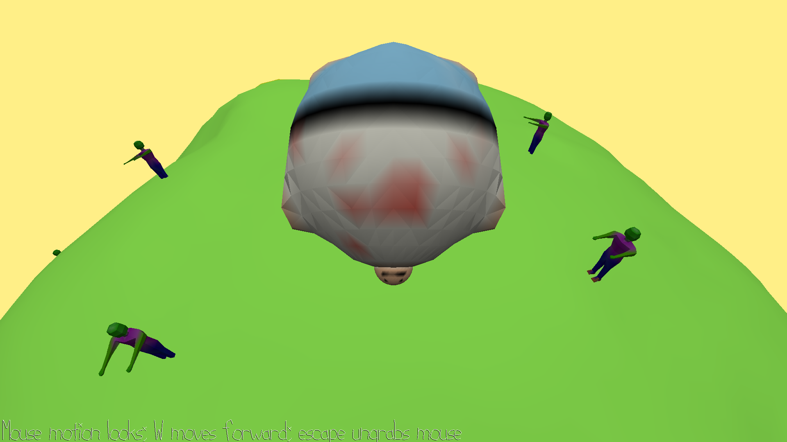

# Large and In-Charge

Author: Henry Du

Design: (TODO: In two sentences or fewer, describe what is new and interesting about your game.)

Screen Shot:

How To Play:

(TODO: describe the controls and (if needed) goals/strategy.)

Sources: (TODO: list a source URL for any assets you did not create yourself. Make sure you have a license for the asset.)

WalkMesh was partially designed using algorithms from the following two sources:
- https://stackoverflow.com/questions/9605556/how-to-project-a-point-onto-a-plane-in-3d
- https://gamedev.stackexchange.com/questions/23743/whats-the-most-efficient-way-to-find-barycentric-coordinates
and also with reference to:
- https://en.wikipedia.org/wiki/Barycentric_coordinate_system#Determining_location_with_respect_to_a_triangle

This game was built with [NEST](NEST.md).

